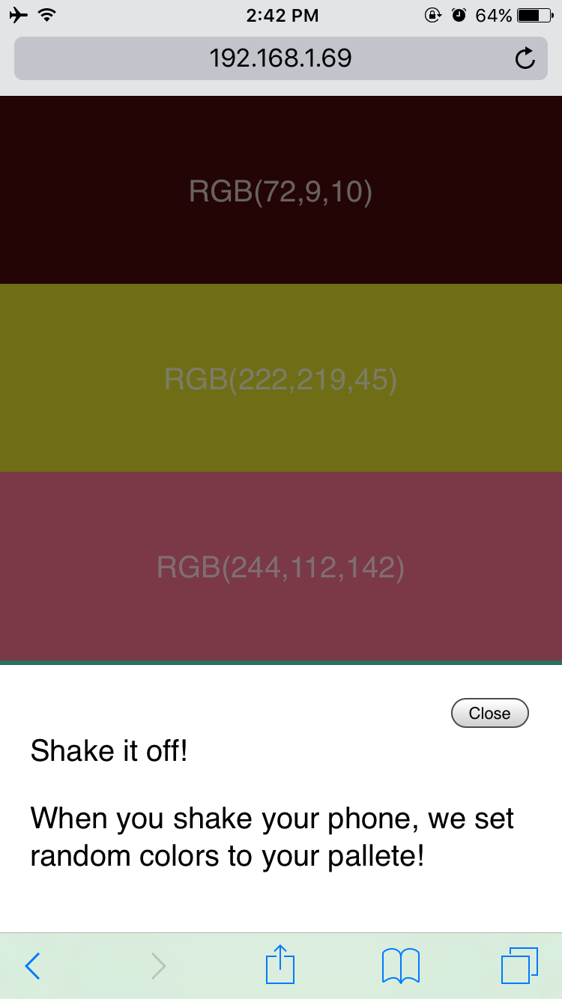
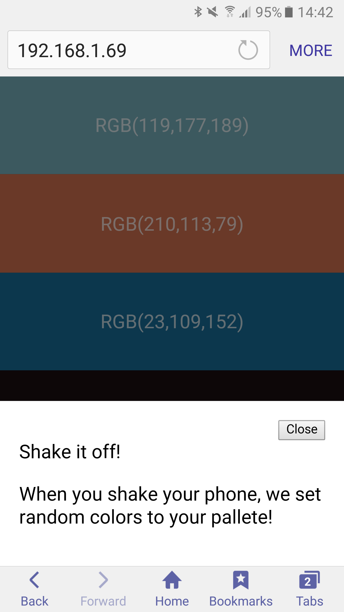

# react-pallete

Mobile first color pallete generator

- Persist with localStorage
- Shake event in mobile browsers
- Use range inputs to update the colors

🎉

#### iOS 10.3 - Safari

### Android 6.0.1 - Internet 4.0.20-73

