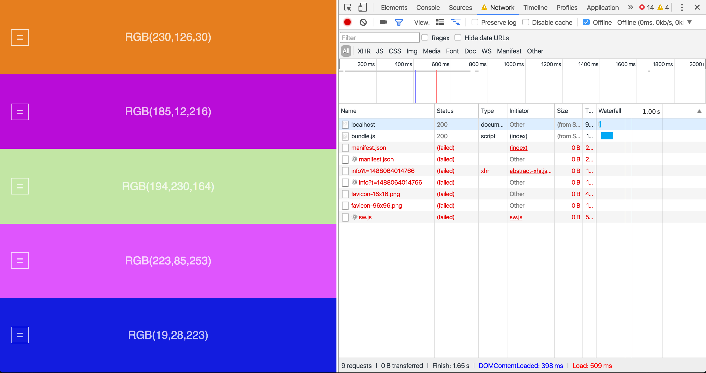

# react-pallete

Mobile first color pallete generator

- Basic PWA / Offline experience
- Persist with localStorage
- Shake event in mobile browsers
- Use range inputs to update the colors
- Drag and drop to rearrange

🎉

#### iOS 10.3 - Safari

### Android 6.0.1 - Internet 4.0.20-73

### Android 6.0.1 - Brave 1.0.15

## Mac OS X El Captain - Google Chrome 56.0.2924.87

Offline example, in localhost:

